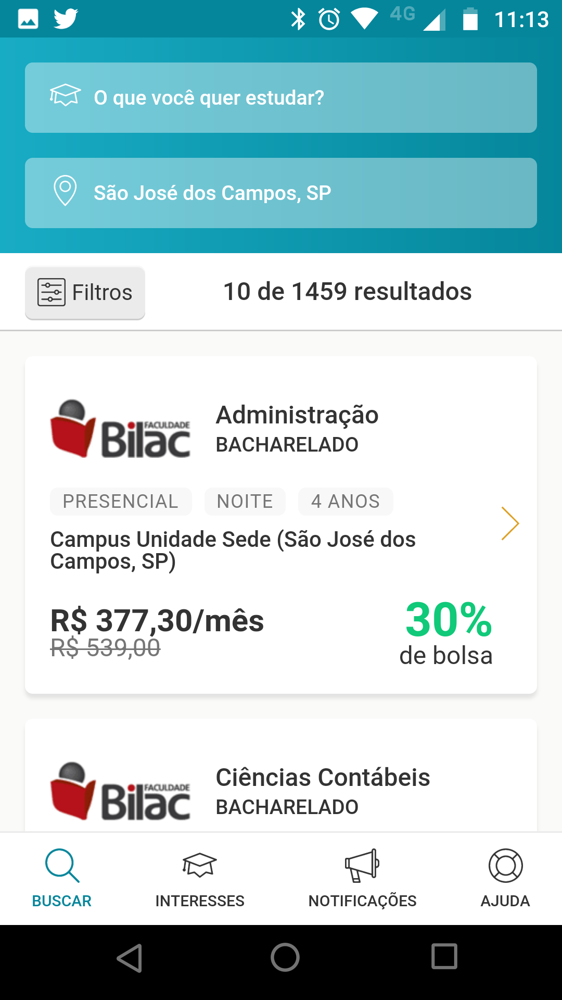
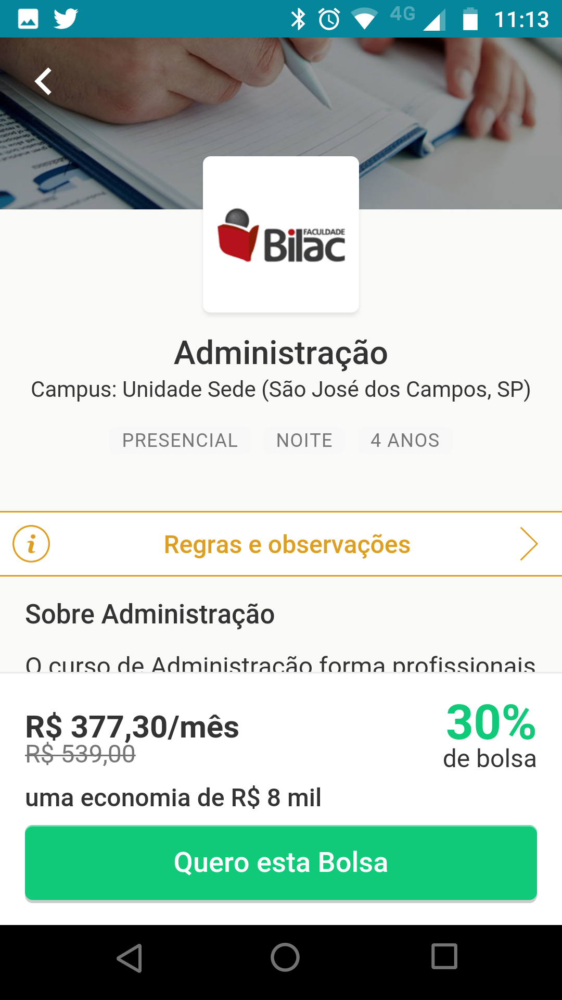
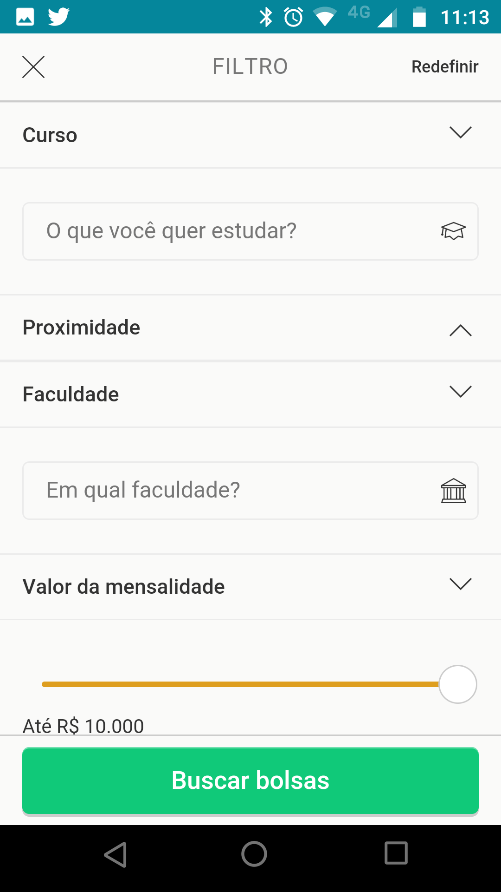

1. Provide a List Scene for the offers endpoint
    * This should be the initial Scene once the users opens the app
    * Upon click of an item the users need to be redirected to corresponding details scene
    * Infinite scrolling of data
    * There should be a way to display the filter Scene (Link,Button, etc)

2) Details Scene
    * Show all the available data coming from the /Offer/{offer_id} endpoint
    * Back button should redirect to List Scene
    * A button/link to acquire the tuition which should open up a modal with a success message.

3) Filter Scene
    * Allow selection of query data for the [backend api](../back/README.md)
    * Once the button is hit the user should be redirected to the List Scene where the data should be filtered accordingly
    * The Filter Scene inputs should keep its state (i.e it should reopen with whatever data was previously selected)
    * A Clear button to clean up data
    * To simplify, there's no need to provide autocomplete capabilities to either courses or universities

## Examples

Follows some example screenshots from our current application (querbolsa @ google play) to serve as a guide.

Please, feel free to disregard any extra funcionalities which are not stated as required (such as geolocation search, number of results, bottom menu, etc )

### List Example

### Detail Example

### Filter Example

